# 基于springboot的美食推荐商城

<h4 style='color:red'>联系不到我，就看我的主页 </h4> 
 
#### 介绍

在当今数字化时代，美食推荐商城成为了人们发现和享受美食的重要平台。本基于 Spring Boot 的美食推荐商城旨在为用户提供丰富多样的美食选择，为商家提供高效的销售渠道，同时为管理者提供便捷的管理工具，以打造一个优质、便捷、互动性强的美食交易和推荐环境。

#### 技术栈

后端技术栈：Springboot+Mysql+Maven

前端技术栈：Vue+Html+Css+Javascript+ElementUI

开发工具：Idea+Vscode+Navicate

#### 系统功能介绍

（一）管理端  
个人中心：管理端人员可在此查看和修改个人信息，接收重要通知和系统消息。  
基础数据管理  
公告类型管理：对商城内发布的公告进行分类，如促销活动公告、新品上架公告、系统维护公告等。  
会员等级类型管理：设置不同的会员等级，如普通会员、黄金会员、钻石会员等，并为每个等级设定相应的权益和优惠政策。  
美食类型管理：对美食进行分类，如中餐、西餐、甜品、小吃等，方便用户筛选和查找。  
公告信息管理：负责发布、编辑和删除商城的公告信息，确保用户及时了解商城的最新动态和重要通知。  
留言板管理：查看和回复用户在留言板上的留言，处理用户的咨询、投诉和建议，维护良好的用户沟通渠道。  
美食管理  
美食管理：对商城内的美食进行全面管理，包括美食的添加、修改、删除，以及美食信息的审核和更新。  
美食评价管理：查看用户对美食的评价，了解美食的受欢迎程度和不足之处，以便对美食进行优化和改进。  
美食收藏管理：掌握用户对美食的收藏情况，分析热门美食和用户喜好趋势。  
美食订单管理：处理美食订单，包括订单的确认、发货、退款等操作，确保交易流程的顺利进行。  
商家管理：对入驻商城的商家进行审核、管理和监督，包括商家信息的审核、商家违规行为的处理等。   
用户管理：管理商城用户的信息，包括用户注册审核、用户权限设置、用户信息修改等。  
轮播图信息：设置商城首页的轮播图内容，如热门美食推荐、限时优惠活动等，吸引用户关注。  

（二）商家端   
公告信息：查看商城发布的公告，了解商城的政策变化、活动安排等重要信息。  
留言板：与用户进行互动，回复用户的留言和咨询，提升用户满意度。  
美食：管理自己店铺的美食，包括美食的上架、下架、价格调整、库存管理等。  
商家：完善和更新商家自身的信息，如店铺介绍、联系方式、营业时间等。  
个人中心：修改个人资料，查看店铺的经营数据和统计信息。  
后台管理  
公告信息管理：接收和查看针对商家的专属公告，如商家活动通知、费用结算通知等。  
美食管理  
美食管理：对店铺内的美食进行详细管理，如美食图片更新、美食描述修改等。  
美食评价管理：查看用户对自家美食的评价，以便改进菜品和服务质量。  
美食收藏管理：了解用户对自家美食的收藏情况，分析受欢迎的菜品。  
美食订单管理：处理用户的美食订单，安排配送或准备自提。  
轮播图信息：根据商城要求设置店铺相关的轮播图，如特色菜品推荐、店铺优惠活动等。  
购物车：方便商家查看用户下单但未结算的商品信息。  

（三）用户端  
公告信息：及时获取商城的最新公告，包括优惠活动、新品上架等消息。  
留言板：向商城或商家提出问题、建议和反馈。  
美食：浏览商城内的各种美食，查看美食详情、图片、用户评价等。  
商家：了解不同商家的信息和特色，选择心仪的商家进行购物。  
个人中心：修改个人信息，查看订单记录、收藏的美食和商家等。  
后台管理  
公告信息管理：关注与个人相关的公告，如订单发货通知、促销活动资格通知等。  
留言板管理：查看自己的留言记录和商家回复。  
美食管理   
美食管理：对感兴趣的美食进行收藏、分享等操作。  
美食评价管理：对购买过的美食进行评价和打分。  
美食收藏管理：方便查看自己收藏的美食列表。  
美食订单管理：跟踪美食订单的状态，如已付款、已发货、已签收等。  
轮播图信息：通过轮播图了解热门美食和推荐商家。  
购物车：将心仪的美食添加到购物车，进行结算购买。  

#### 系统作用

提供便捷的美食购物体验  
用户可以轻松浏览和购买各种美食，节省时间和精力。  
促进商家业务发展  
为商家提供了广阔的销售平台，增加曝光度和销售额。  
高效管理和运营  
管理端能够有效地监管商城，确保交易的公平、安全和有序。  
增强用户互动和参与  
通过留言板和评价功能，促进用户与商家、管理端之间的交流，提升用户满意度和忠诚度。  
精准营销和推荐  
基于用户的浏览和购买行为，为用户提供个性化的美食推荐，提高销售转化率。  

#### 系统功能截图

代码结构

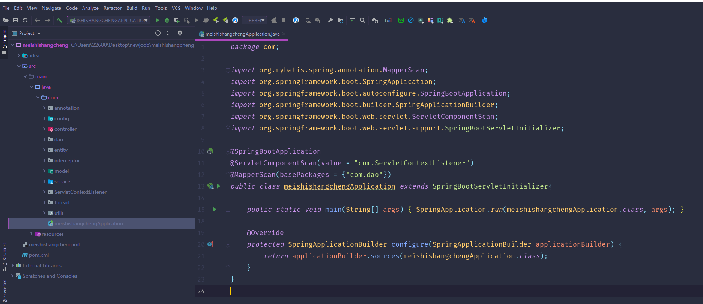

数据库表

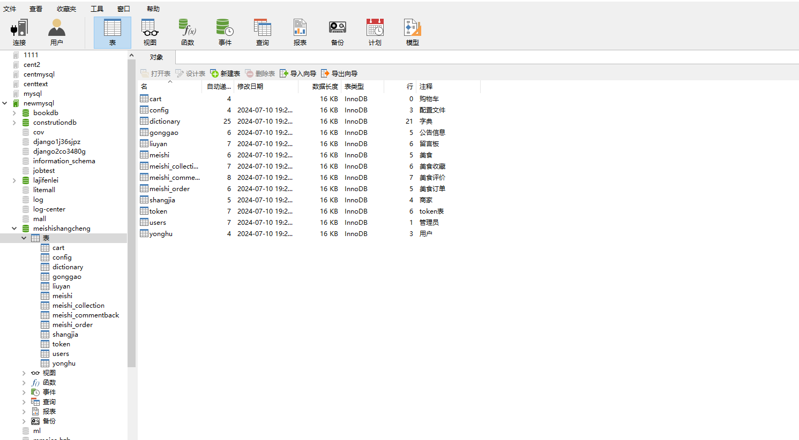

登录

前台页面首页

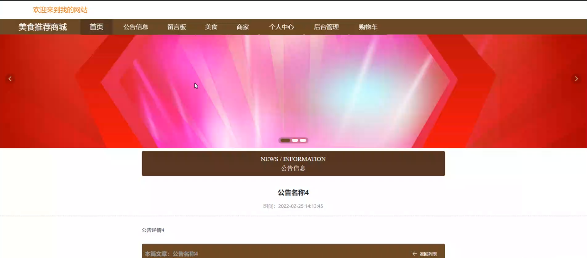

公告信息

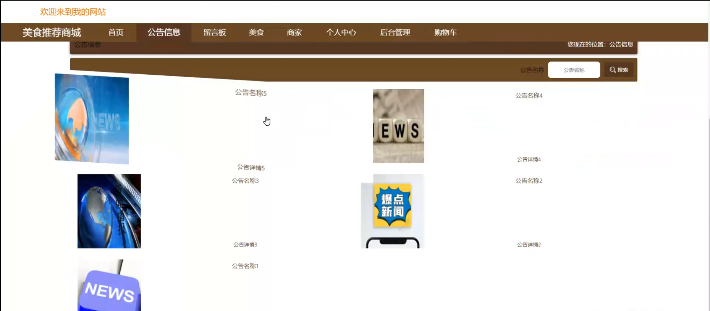

留言板

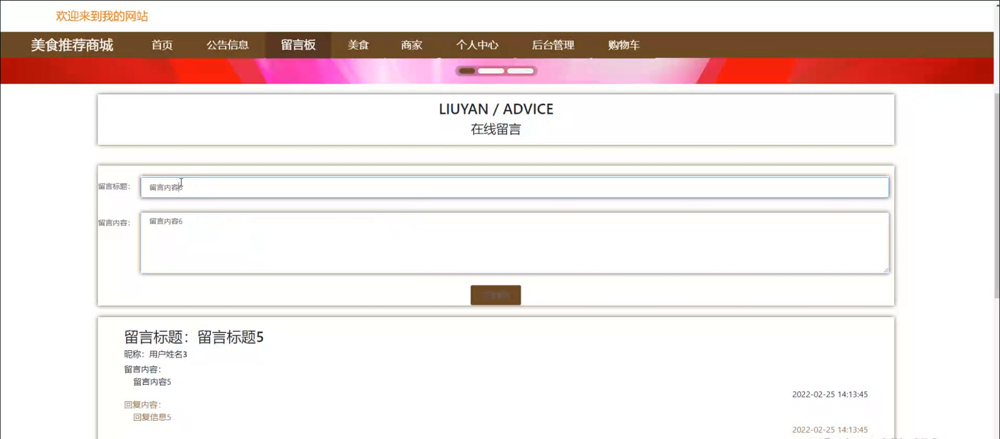

美食

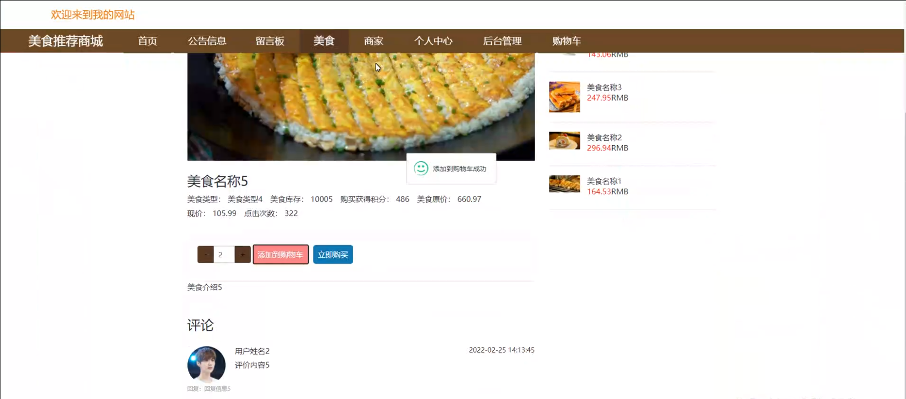

购物车

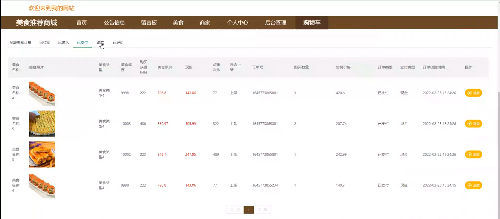

个人中心

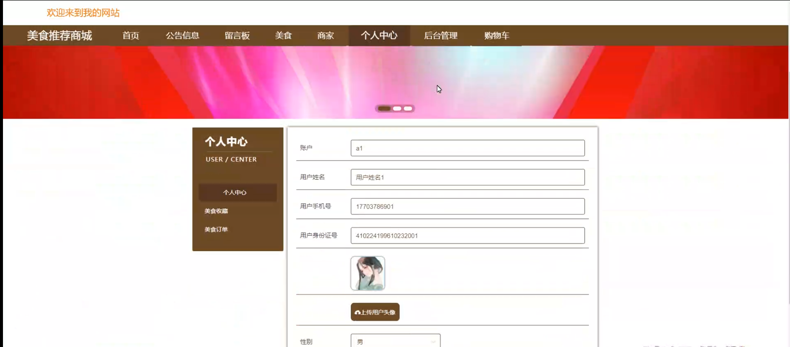

商家端个人信息

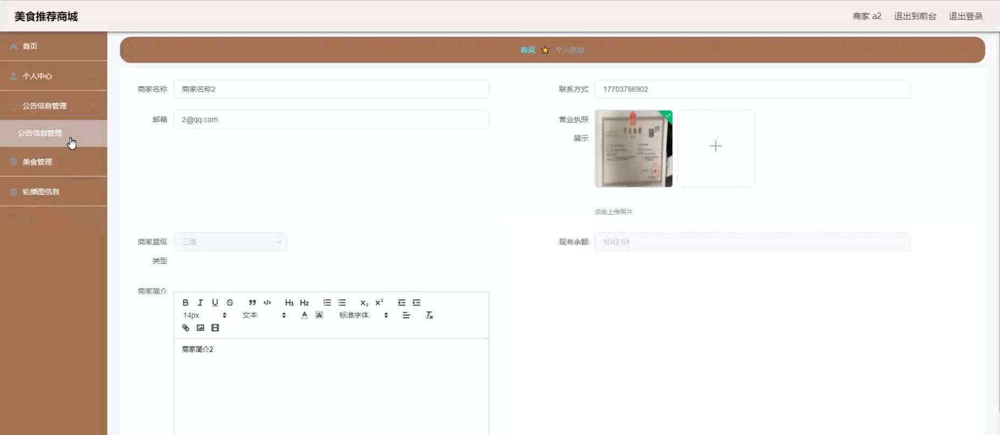

美食订单管理

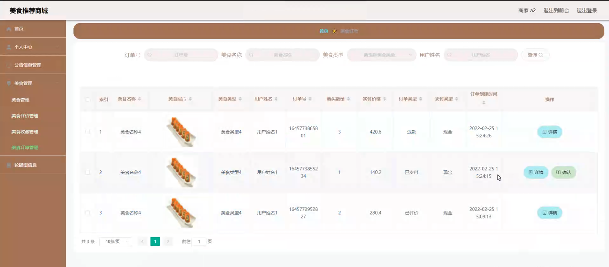

美食评价

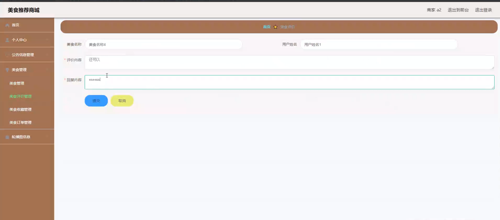

用户端后台管理

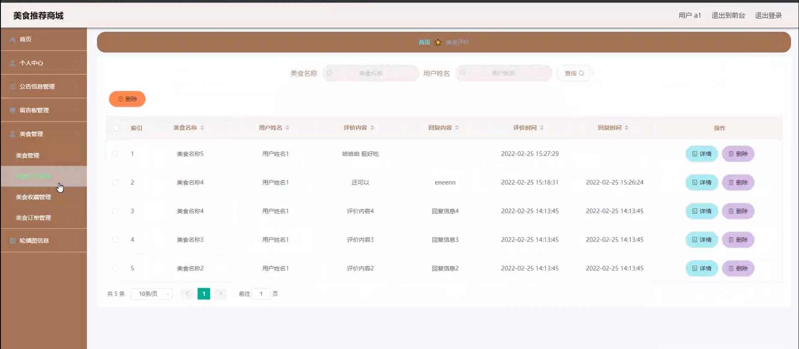

管理员端基础数据管理

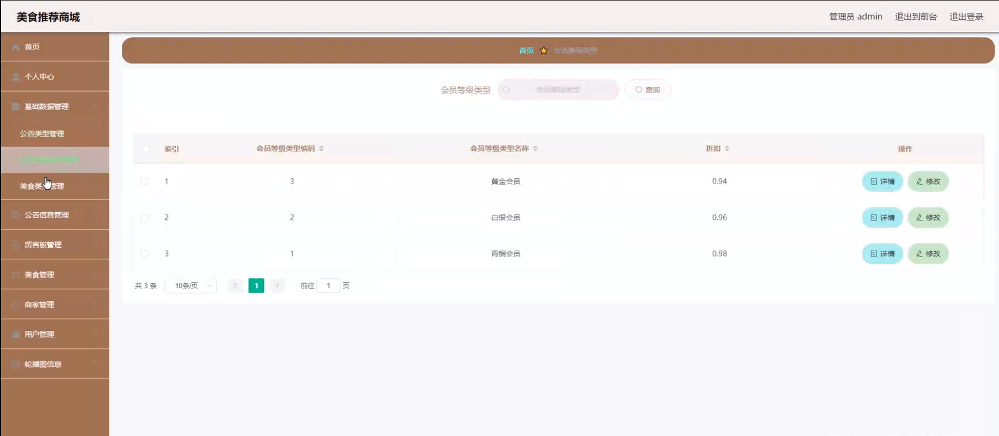

用户管理

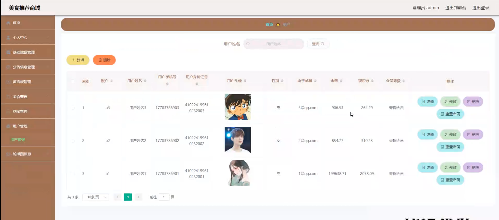

商家管理

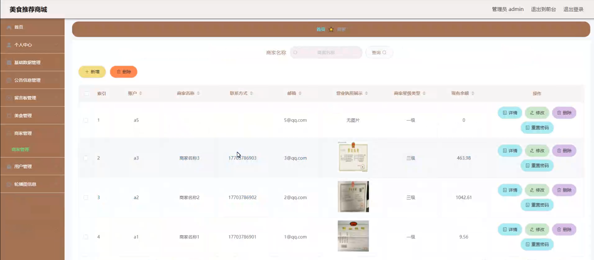

#### 总结

基于 Spring Boot 的美食推荐商城，通过管理端、商家端和用户端的协同工作，实现了美食交易的全流程管理和服务。各端功能丰富且相互配合，为用户带来了便捷的美食探索之旅，为商家创造了更多的商业机会，同时也为管理者提供了高效的运营工具，共同推动美食推荐商城的持续发展和繁荣。

#### 使用说明

创建数据库，执行数据库脚本 修改jdbc数据库连接参数 下载安装maven依赖jar 启动idea中的springboot项目

前台登录页面
http://localhost:8080/meishishangcheng/front/index.html

后台登录页面
http://localhost:8080/meishishangcheng/admin/dist/index.html

管理员		   	账户:admin 	密码：admin  

商家				账户:a1 		密码：123456  

用户				账户:a1 		密码：123456  